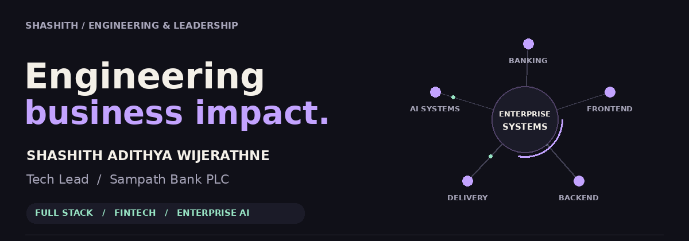
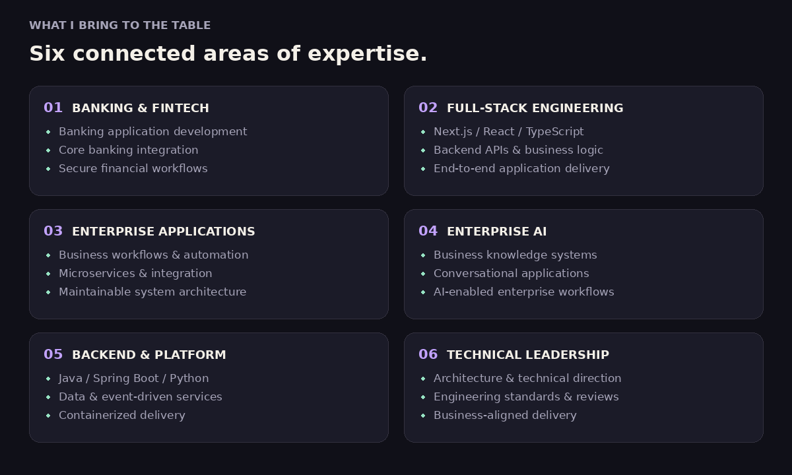
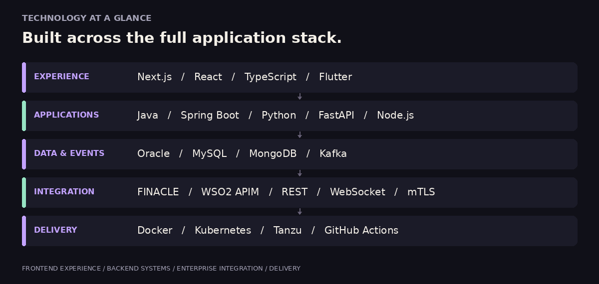

### Shashith Adithya Wijerathne
### Tech Lead at Sampath Bank PLC

**Banking & FinTech · Full-Stack Engineering · Enterprise Architecture · Applied AI**

I lead technical delivery and build **secure banking platforms, enterprise applications, and AI-enabled business systems**. My work spans **React and Next.js interfaces, Java and Python services, event-driven integrations, and production deployments**.

With **6+ years in software engineering**, I combine hands-on development with architecture decisions, code reviews, mentoring, and collaboration across business, QA, and infrastructure teams.

## What I bring

| Focus | Engineering contribution |
| :--- | :--- |
| **Banking & FinTech** | Customer validation, credit decisioning, loan processing, payments, and digital banking integrations |
| **Full-stack delivery** | Responsive interfaces, reusable components, API integration, and backend business logic |
| **Enterprise architecture** | Microservices, event-driven systems, Clean Architecture, and reusable service boundaries |
| **Applied AI** | Model wrappers, vLLM integration, document extraction and validation, and AI-assisted customer evaluation |
| **Production engineering** | Containerized deployments, automated delivery, code quality, and vulnerability assessment |
| **Technical leadership** | Technical direction, mentoring, design reviews, engineering standards, and release coordination |

## Core stack

<strong>Explore my technology ecosystem</strong>

| Area | Technologies & practices |
| :--- | :--- |
| **Frontend** | Next.js · React · TypeScript · JavaScript · HTML5 · CSS3 · Bootstrap · Angular · Vue.js |
| **Backend** | Java · Spring Boot · Java EE / Jakarta EE · Python · FastAPI · Node.js · Django · PHP · Laravel |
| **Architecture & APIs** | Microservices · Event-driven architecture · Clean Architecture · REST · Webhooks · OpenAPI · Swagger |
| **Databases** | Oracle · PostgreSQL · MySQL · MongoDB · Firebase · SQL optimization · Transaction management |
| **Messaging & processing** | Apache Kafka · RabbitMQ · Apache Spark · ZooKeeper |
| **Banking & integration** | FINACLE integration · WSO2 API Manager · Secure WebSocket · Enterprise service integration |
| **Security** | mTLS · API keys · OTP verification · Authentication · Authorization · API access controls |
| **Cloud & infrastructure** | AWS · Microsoft Azure · Docker · Docker Compose · Kubernetes · Helm · VMware Tanzu · Linux · NGINX · Traefik |
| **CI/CD & quality** | Git · GitHub Actions · Jenkins · GitLab CI · AWS CodePipeline · AWS CodeBuild · SonarQube · Veracode · Qualys |
| **Engineering tools** | Maven · Lombok · Log4j2 · Spring Boot Actuator · SQLAlchemy · Alembic |
| **Application servers** | IBM WebSphere Application Server · Apache Tomcat · WildFly |
| **Mobile & platforms** | Flutter · Android · WordPress |
| **Enterprise AI** | AI model wrappers · vLLM model serving · Local model hosting · Document data extraction · Document validation · AI service integration |

## How I engineer

| Frontend craft | Enterprise discipline | Technical leadership |
| :--- | :--- | :--- |
| Reusable component architecture | Secure APIs and service boundaries | Clear architecture decisions |
| Typed API integration | Consistent error handling and logging | Practical code and design reviews |
| Responsive, usable interfaces | Reliable transactions and event flows | Mentoring and knowledge sharing |
| Performance-conscious implementation | Automated delivery and quality checks | Business-aligned technical priorities |

## Education

**BSc — Sri Lanka Institute of Information Technology (SLIIT)**  
**MSc Software Engineering — Kingston University · In progress**

---

### Complex requirements. Clear engineering.

**Banking & FinTech · Enterprise Applications · Full-Stack Development · Applied AI**

[Discuss your next application →](https://www.linkedin.com/in/shashith-adithya-876382182/)

